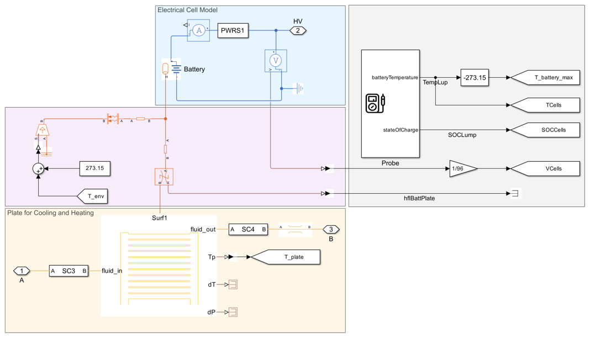
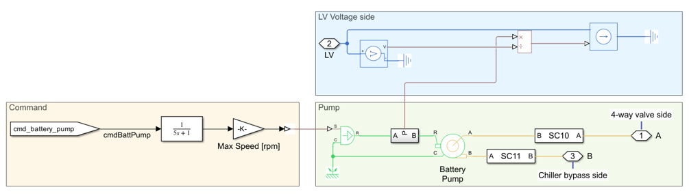

## A Holistic Approach for Designing a Battery Electric Vehicle Thermal Management System
This repository contains a model of a battery electric vehicle (BEV) with a thermal 
management system. This virtual vehicle model was parametrized to describe a mid-size electric sedan [1].

View on File Exchange:   
You can also open in MATLAB Online: 

## Description
The figure below illustrates the virtual vehicle developed using Simscape and its add-on products. 
The model simulates a mid-size sedan with rear wheel drive and comprises five subsystems: 
- **Electric Powertrain**
- **Driveline**
- **Refrigerant Cycle**
- **Coolant Cycle**
- **Cabin Cycle**

The control algorithms are implemented in Simulink and are contained in the **Controls** subsystem.

An advantage of the virtual vehicle is its versatility: All parameters are set up by one single script. 
Therefore, the model can be easily adjusted to simulate different vehicle types, such as small city 
cars or SUVs, with minimal modifications.

## Electric Powertrain
The electric powertrain is comprised of a charger, traction battery, motor, and DC-DC converter.

### Battery
The battery consists of 3072 cylindrical cells (21700 format) in a 96s32p electrical scheme, with a 
total energy of 50 kWh when fully charged. It is modeled with Simscape Battery using an electrothermal 
model. The electrical model monitors the State of Charge (SOC) of the cells, their losses, and the 
remaining capacity. The thermal model calculates the change in cell temperature due to electrical losses. 
The battery supplies current to the powertrain on the HV network and is actively cooled by a cooling 
plate composed of 12 parallel channels.

### Motor
The electric motor is driven by the HV network and is mechanically connected to the vehicle’s 
rear axle. The virtual vehicle can be easily extended to describe other powertrain architectures 
(e.g., front or all-wheel drive). The motor’s characteristics and losses are modelled with efficiency 
maps. Its temperature depends upon the electrical losses and its thermal mass. To transmit the 
torque to the wheels, the motor is coupled with a gearbox with a constant transmission ratio. 
The gearbox losses are modelled with a constant efficiency.

### DC-DC Converter
The DC-DC converter transforms the battery’s voltage (~380 V) to a lower voltage level (12 V) 
and supplies the LV components (pumps, blower, and condenser fan). Electrical losses are accounted 
for with a constant efficiency. A thermal model calculates the temperature change based on the 
DC-DC thermal mass and its electrical losses.

## Driveline
The driveline includes tires and vehicle body. The tire models account for rolling resistance, 
inertia, and slip. The vehicle body model calculates drag, wind, and road incline losses.
The vehicle body also accounts for the impact of the vehicle's mass on acceleration behavior.

## Refrigerant Cycle
The refrigerant cycle comprises compressor, condenser, chiller expansion valve (EV1), evaporator 
expansion value (EV2), chiller, and evaporator. More information regarding the refrigerant cycle 
is available at [2].

The refrigerant flow is driven by the compressor, which is connected to the HV electrical network. 
The refrigerant flow continues to the condenser where heat is dissipated to the air. The air flow 
within the condenser is driven by the vehicle speed the condenser fan. Latter is connected to the 
LV network.

The refrigerant then flows through EV1 and EV2 and continues to chiller and evaporator. In the 
chiller, the refrigerant absorbs heat from the coolant cycle. In the evaporator the refrigerant 
absorbs heat from the cabin air and continues its way back to the compressor.

The figure below shows the main component of the refrigerant cycle:

## Coolant Cycle
The coolant cycle comprises motor pump (P1), battery pump (P2), radiator, radiator bypass valve, 
heater, chiller bypass valve, and four-way valve. This cycle cools down the electric powertrain 
components. More information to this regard is available at [2].

The pumps P1 and P2 drive the coolant flow and are supplied by the LV network. In the radiator, 
the coolant dissipates heat to the neighboring air (driven by the fan and the moving vehicle). 
If the outer temperature is lower than 20°C, the radiator is bypassed. If the battery reaches a 
temperature below 5°C, the heater is activated (supplied by HV current) and heats up the coolant. 
If the battery reaches a temperature below 30°C the chiller is bypassed via the chiller bypass valve. 
Finally, the four-way valve can switch between a parallel and a serial cooling strategy based on the 
environmental conditions and the temperatures of the powertrain components. In serial mode 
(A connected to B, C connected to D), the battery coolant loop is connected to the motor coolant loop. 
In parallel mode (A connected to D, B connected to C), the two coolant loops are separated and 
operate with their own coolant tanks and pumps. 

The figure below shows the main component of the coolant cycle:

## Cabin Cycle
The cabin cycle comprises cabin, blower, Positive Temperature Coefficient Heater (PTC), and 
evaporator. More information to this regard is available at [2].

The cabin subsystem models the thermal resistances between interior and external environment 
(considering the convection and conduction through doors, roof, and widows). Additionally, the 
model also accounts for the radiation heat entering the cabin.

The blower drives the airflow in the cabin and is supplied by the LV network. The air from the 
blower passes through the evaporator where it can dissipate its heat to the refrigerant. If 
cabin heating is required, the PTC is activated and heats up the air entering the cabin. Otherwise, 
the PTC remains turned off. 

The figure below shows the main component of the cabin cycle:

## Controls
The control system is implemented in Simulink. It controls several functions of the thermal 
management among which:
- Bypass valve for radiator and chiller
- Command for heater and PTC heater
- Switching between parallel and serial cooling model (see [1] and [2] for more information to this regard)
- Power request for Pumps (P1 and P2 in the fgure), compressor, radiator, and condenser fan
- Controller for driver commands

## Scenarios: 
The model can simulate three different scenarios.
- Summer: In the summer scenario the outer temperature is set to 40°C and the vehicle drives an urban cycle (low speed and several stops)
- Winter: In the winter scenario the outer temperature is set to 5°C and the vehicle drives a highway cycle (high speed and no stop)
- Highway with Charging Stops: A highway cycle in summer with two charging stops and a total length of 600 km

The first two cycles are implemented for the sensitivity and optimization workflow presented in the next sections. The drive cycle are set in the Scenario subsystem:

The drive cycles are loaded as a variable containing the speed over time profile of the vehicle. 
The cycles will use different components. For example, components like Evaporator, Condenser, Chiller are used only in summer. On the other hand, component such as the heater and the PTC heater are needed only in winter.
The figure below shows the drive cycle that is used for the Summer scenario:

## Postprocessing
After simulation the results are processed by the function [calcVehicleEnergy.m](/Scripts_Data/Scripts/04_PlotFunctions/calcVehicleEnergy.m). This function calculates the losses (in kWh) of each subsystem of the vehicle. The results can be represented in different ways.
First possible way is to employ the functions [plotVehicleEnergy.m](/Scripts_Data/Scripts/04_PlotFunctions/plotVehicleEnergy.m) and [plotHVACEnergy.m](/Scripts_Data/Scripts/04_PlotFunctions/plotHVACEnergy.m) to plot the consumptions as bar plots. An exemplarly plot is shown below:

It is also possible to use the [plotEnergySankey.m](/Scripts_Data/Scripts/04_PlotFunctions/plotEnergySankey.m) function to represent the overall consumption with a Sankey diagram

Alternatively, if not interested specifically in the consumption, the best way to 
analyze the overall results of the model is with the 
[Simscape Results Explorer](https://www.mathworks.com/help/simscape/ug/using-the-simscape-results-explorer.html).

## Sensitivity Analysis Workflow
This repository contains the workflows for performing sensitivity analysis on the model. The analysis is divided into two primary workflows:
1. Single Parameter Sensitivity
2. Multiple Parameter Sensitivity

The Single Parameter Sensitivity evaluates the impact of a single parameter on the entire model. It helps identify how specific interdependencies are affected by that parameter.
The Multiple Parameters Sensitivity assesses simultaneous variation of multiple parameters to understand how the several parameters collectively impact a certain objective
For both types of sensitivity analysis, the impact of the parameter variation is assessed based on two key objectives:
- **Consumption:** The overall vehicle consumption in the summer of in the winter cycle.
- **Battery Time:** The time required for the battery to reach a "safe temperature zone", ensuring it is neither too hot nor too cold. This variable indicates thermal management performance.

### Single Sensitivity
The single sensitivity analysis tests the impact of individual parameters on various variables. The parameters considered include:
- Plate pipe radius, see script [sensitivityPlate.m](/Workflows/Sensitivity/Component%20Sensitivities/sensitivityPlate.m)
- Heater and PTC power, see script [sensitivityHeater.m](/Workflows/Sensitivity/Component%20Sensitivities/sensitivityHeater.m)
- Chiller radius, see script [sensitivityChiller.m](/Workflows/Sensitivity/Component%20Sensitivities/sensitivityChiller.m)
- Evaporator and condenser length, see script [sensitivityCondenser.m](/Workflows/Sensitivity/Component%20Sensitivities/sensitivityCondenser.m)
- Gearbox ratio, see script [sensitivityTransmission.m](/Workflows/Sensitivity/Component%20Sensitivities/sensitivityTransmission.m)

Each parameter has a dedicated script for sensitivity analysis. The scripts perform the analysis for specific scenarios (e.g., winter or summer) and display results using various plots.
For example, the plot below shows how the temperature of the battery changes in a winter scenario if the heater power is increased

  

The temperature of the battery increases faster if the power heater is higher. This is beacuse a more powerful heater can transmit more heat to the battery 

  

At the same time, this comes with a price. A more powerful heater requires more power, which needs to be provided by the battery. The battery energy consumption (and hereby the overall consumption) will increase as we increase the heater power.

  

## Global Sensitivity
Global sensitivity analysis requires Simulink Design Optimization. This workflow simultaneously alters all the parameters mentioned in the previous section.
The implementation is documented in the script [sensitivityGlobal.m](/Workflows/Sensitivity/sensitivityGlobal.m). Provided that a parallel computing toolbox is available, the sensitivity analysis can also be parallelized to save time.

The results can be represented with the function [postproSensitivity.m](/Workflows/Sensitivity/postproSensitivity.m)

  

## Optimization
This project includes an optimization workflow using `surrogateopt` to minimize vehicle consumption by varying specific parameters. The goal is to optimize the following parameters:
- Plate pipe radius
- Heater and PTC power
- Chiller radius
- Evaporator and condenser length
- Gearbox ratio

The optimization seeks to minimize the combined consumption of the vehicle, which includes both summer and winter scenarios. Given the difference in magnitude between these scenarios, they are scaled before being combined. The objective function is defined as:

F(x) = s1 * consumption_winter + s2 * consumption_summer

Where `s1` and `s2` are scaling factors.

The optimization process ensures that the following constraints are met:
- The cabin must reach a target temperature within 12 minutes.
- The battery must reach a target temperature within 10 minutes.

To explore the implementation details of the optimization, refer to the function [surrOptBEV.m](/Workflows/Optimization/surrOptBEV.m).
If a Parallel Computing toolbox is available, the optimization can be parallelized using the function [surrOptBEVParallel.m](/Workflows/Optimization/surrOptBEVParallel.m).
For postprocessing the results, you can use the function [postproOptim.m](/Workflows/Optimization/postproOptim.m).
Below is a possible representation of the optimization results created with postproOptim

 
## Installation
The model was developed using MATLAB release R2024b and requires the following products:
   * [MATLAB&reg;](https://www.mathworks.com/products/matlab.html)
   * [Simulink&reg;](https://www.mathworks.com/products/simulink.html)
   * [Stateflow&reg;](https://www.mathworks.com/products/stateflow.html)
   * [Simscape&trade;](https://www.mathworks.com/products/simscape.html)
   * [Simscape Battery&trade;](https://www.mathworks.com/products/simscape-battery.html)
   * [Simscape Driveline&trade;](https://www.mathworks.com/products/simscape-driveline.html)
   * [Simscape Electrical&trade;](https://www.mathworks.com/products/simscape-electrical.html)
   * [Simscape Fluids&trade;](https://www.mathworks.com/products/simscape-fluids.html)

The sensitivity and optimization workflows additionally require
   * [Simulink Design Optimization](https://www.mathworks.com/products/sl-design-optimization.html)
   * [Global Optimization Toolbox](https://www.mathworks.com/products/sl-design-optimization.html)
   * [Parallel Computing Toolbox](https://www.mathworks.com/products/parallel-computing.html)

## Usage
The parametrization of the single components has been checked for consistency. The 
entire vehicle model has been parametrized similar to a mid-size electric sedan and is 
representative for this type of vehicle. If desired, other vehicles can be simulated by 
adapting the parameterization.

## Support
For any questions regarding the model place a comment in the repository.

## Authors and acknowledgment
* Lorenzo Nicoletti: Developer
* Steve Miller: Technical support

## License
See [license](LICENSE.md) file attached to this repository

## Project status
In development

## Sources
[1] A Holistic Approach for Designing a Battery Electric Vehicle Thermal Management System, 
Steve Miller, Lorenzo Nicoletti

[2] The MathWorks. “Electric Vehicle Thermal Management - MATLAB & Simulink.”, Available 
[here](https://www.mathworks.com/help/hydro/ug/sscfluids_ev_thermal_management.html). 
 
